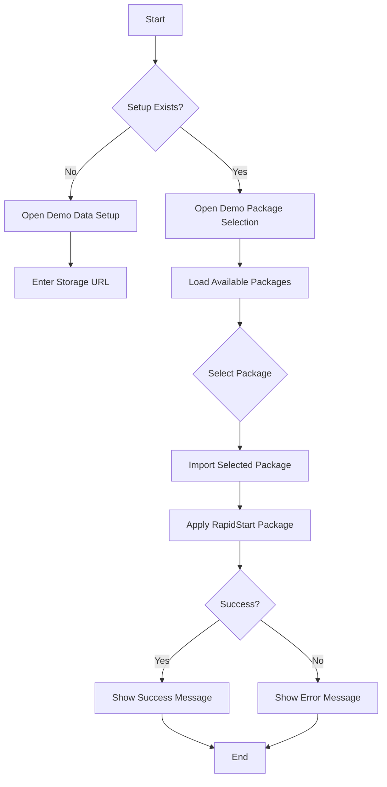
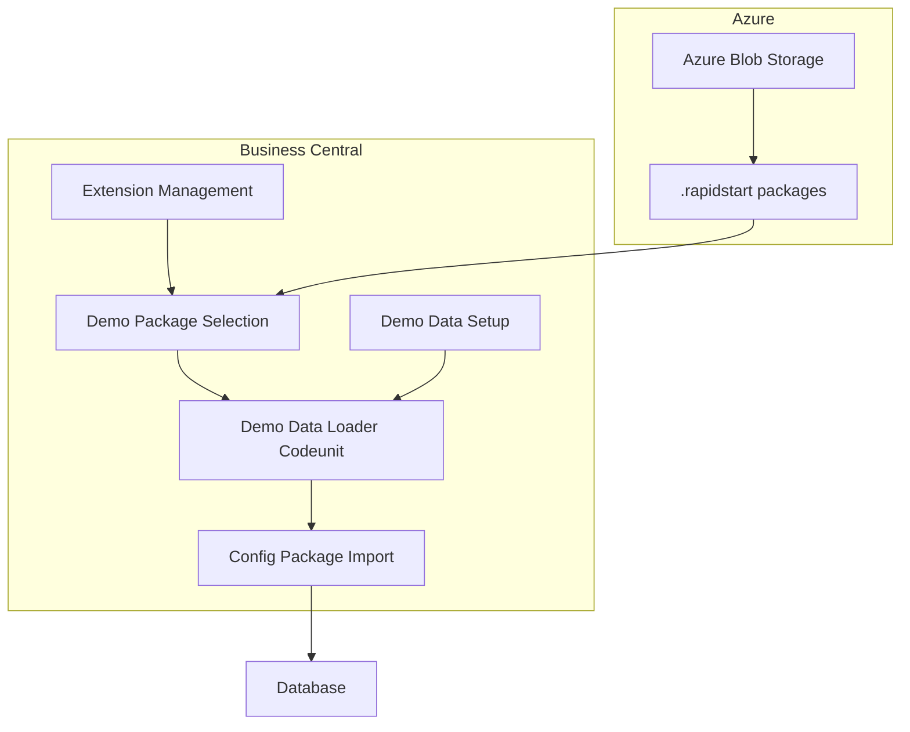
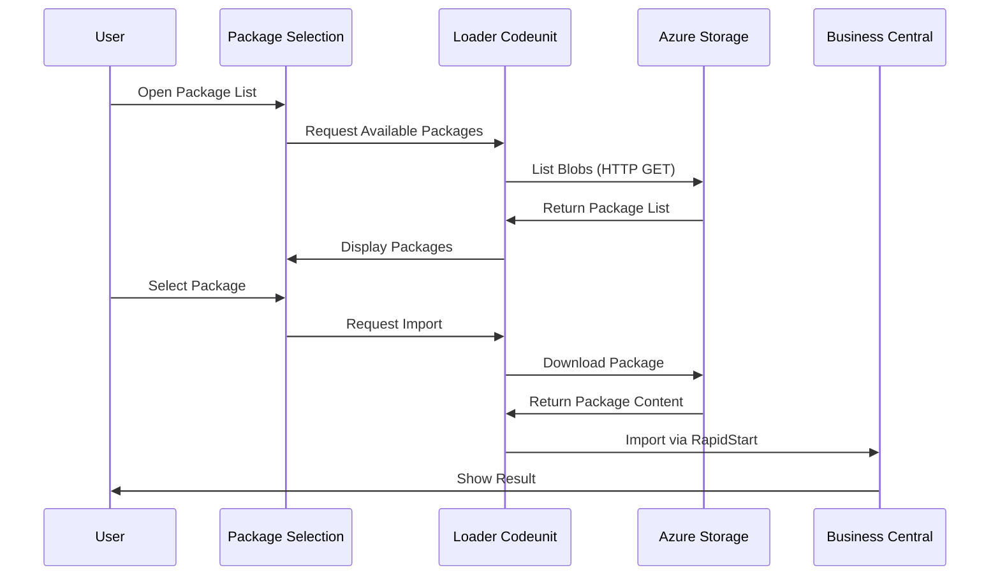

# Demo Data Loader Extension

This extension provides functionality to load demo data into Business Central using RapidStart packages stored in Azure Blob Storage. It allows for flexible configuration and easy importing of multiple demo data packages.

## Setup Process

1. Configure Azure Blob Storage:
   - Create an Azure Storage Account
   - Create a container with public read access
   - Upload your .rapidstart packages to the container
   - Copy the container URL

2. Configure Business Central:
   - Navigate to Demo Data Setup
   - Enter the Azure Blob Storage URL

## Process Flow

## Technical Architecture

## Package Loading Process

## Components

### Tables
- **Demo Data Setup (50101)**: Stores Azure Blob Storage configuration
  - Primary Key
  - Storage URL

### Pages
- **Demo Data Setup (50101)**: Card page for configuration
- **Demo Package Selection (50102)**: List page showing available packages

### Codeunits
- **Demo Data Loader (50100)**: Core functionality for:
  - Listing available packages
  - Downloading packages
  - Importing packages

### Page Extensions
- **Extension Management**: Adds actions for:
  - Opening package selection
  - Opening setup

## Error Handling

The extension handles various error scenarios:
- Invalid storage URL
- Unable to connect to Azure
- Package download failures
- Import failures

## Best Practices

1. **Package Naming**:
   - Use descriptive names
   - Always end with .rapidstart
   - Include version or date if relevant

2. **Azure Storage**:
   - Use a dedicated container
   - Consider implementing access controls for production
   - Regular cleanup of old packages

3. **Package Content**:
   - Test packages before uploading
   - Document package contents
   - Include only necessary data

## Usage Examples

### Basic Import
1. Open Extension Management
2. Click "Import Demo Data"
3. Select package from list
4. Confirm import
5. Wait for completion message

### Multiple Packages
1. Open Demo Package Selection
2. Select first package
3. Import and wait for completion
4. Repeat for additional packages

## Troubleshooting

Common issues and solutions:
1. **Cannot see packages**:
   - Verify storage URL
   - Check container access
   - Ensure packages end with .rapidstart

2. **Import fails**:
   - Check package format
   - Verify data compatibility
   - Review error message

3. **Access denied**:
   - Verify container permissions
   - Check storage account status

## Security Considerations

1. **Azure Storage**:
   - Public read access required
   - Consider SAS tokens for production
   - Regular security audits

2. **Business Central**:
   - User permissions required
   - Data sensitivity awareness
   - Import validation
